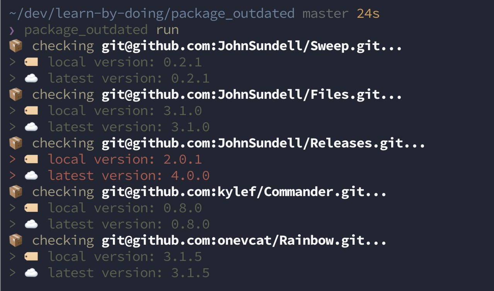

# vintage

[](#)
[](https://swift.org/package-manager)
[](https://twitter.com/vinhnx)

A small command-line tool to check outdated Swift Package Manager dependencies. 

📦 pseudo `swift package outdated` command. 

Think `pod outdated` or `carthage outdated`, but for Swift Package Manager. 


 
## Installation

**[homebrew](https://brew.sh)**

```bash
$ brew tap vinhnx/homebrew-formulae
$ brew install vintage
```

or
```bash
$ brew install vinhnx/homebrew-formulae/vintage
```

**[Mint](https://github.com/yonaskolb/mint)**

```bash
$ mint install vinhnx/vintage
```

**[Marathon](https://github.com/JohnSundell/Marathon)**

```bash
$ marathon install vinhnx/vintage
```

**Make**

```bash
$ git clone https://github.com/vinhnx/vintage.git
$ cd vintage
$ make
```

**Swift Package Manager**

```bash
$ git clone https://github.com/vinhnx/vintage.git
$ cd vintage
$ swift build -c release
$ cp -f .build/release/vintage /usr/local/bin/vintage
 ```

## Usage

Without any specifications (have to be executed in the directory where [Swift Package Manager manifest file (Package.swift)](https://github.com/apple/swift-package-manager/blob/master/Documentation/Usage.md) is located):

```bash
$ vintage
```

Specifies path of Swift Package Manager directory to update:

```bash
$ vintage -p Dependencies
```

Help page:

```bash
$ vintage --help

Usage:

    $ vintage

Commands:

    + run - Check project's Package dependencies' local version with remote latest version.

```

## Dependencies

+ [Sweep](https://github.com/JohnSundell/Sweep)
+ [Files](https://github.com/JohnSundell/Files)
+ [Releases](https://github.com/JohnSundell/Releases)
+ [Commander](https://github.com/kylef/Commander)
+ [Chalk](https://github.com/mxcl/Chalk)

## Reference

+ [Swift Package Manager usage document](https://github.com/apple/swift-package-manager/blob/master/Documentation/Usage.md#create-a-package)
+ [git ls-remote](https://git-scm.com/docs/git-ls-remote.html)
+ [carthage outdated](https://github.com/Carthage/Carthage/blob/master/Source/carthage/Outdated.swift)
+ I was heavily inspired by these awesome talks:
  + [Swift Scripting by Ayaka Nonaka](https://academy.realm.io/posts/swift-scripting/)
  + [John Sundell: Swift scripting in practice](https://www.youtube.com/watch?v=PFdh5G3BJqM)

## Help, feedback or suggestions?

Feel free to contact me on [Twitter](https://twitter.com/vinhnx) for discussions, news & announcements & other projects. :rocket:
